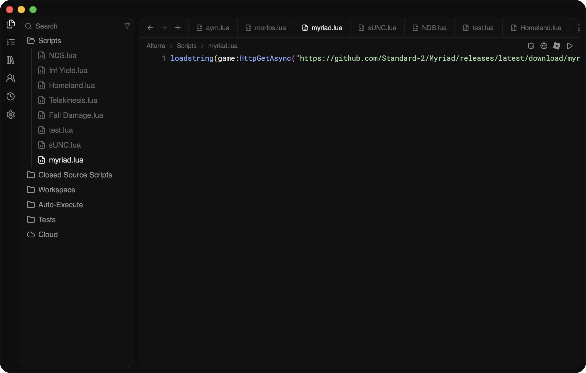
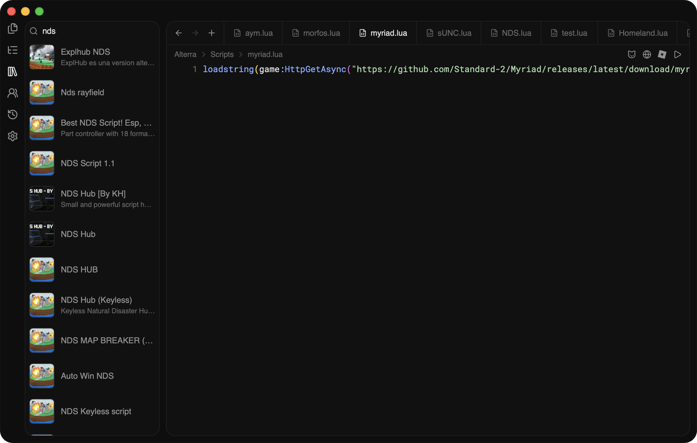
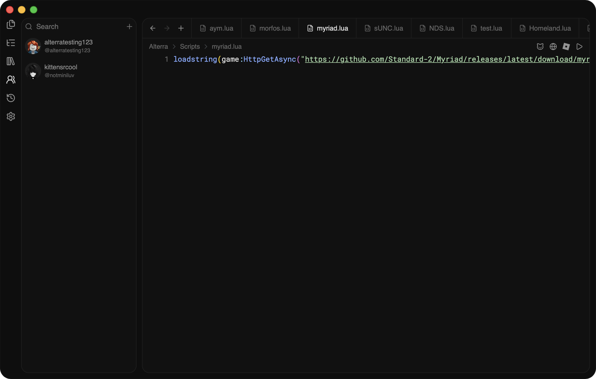
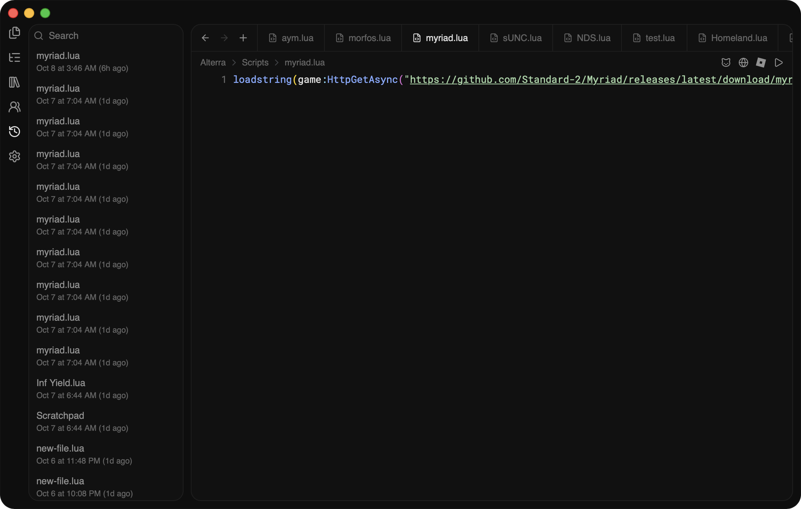
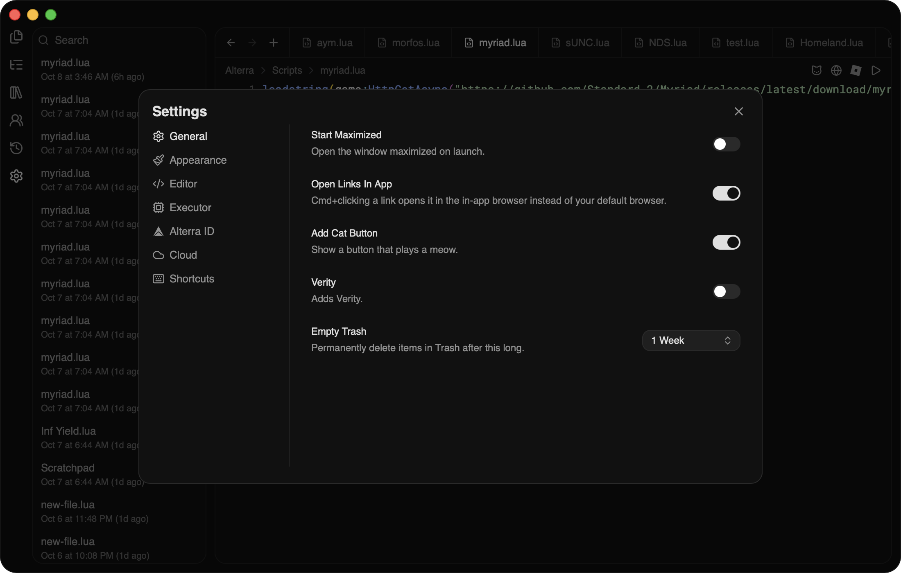

# Alterra
Alterra is the best free and keyless Roblox executor for macOS.

[Website](https://www.alterrasoftware.site) · [Discord](https://discord.gg/zJfXUQshsJ)
# Installation
```bash
curl -fsSL "https://alterrasoftware.site/internal/install.sh" | bash
```
# Requirements
- macOS 11 or later
- An Apple silicon Mac (M1 or newer)
# sUNC and Myriad
Alterra scores [100% on sUNC](https://r.sunc.su/8xv3J9psnX) and 100% on Myriad.
# Performance
Alterra is native to Apple silicon and focused on performance. Unlike other executors, everything is as optimized as it can be.
# Detection
Alterra is currently undetected, there have been 0 reported cases of users being banned from Roblox.
# Gallery





